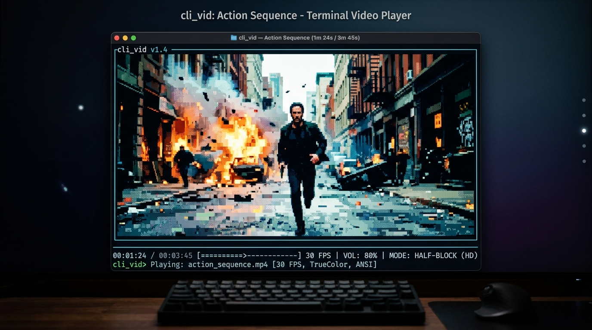
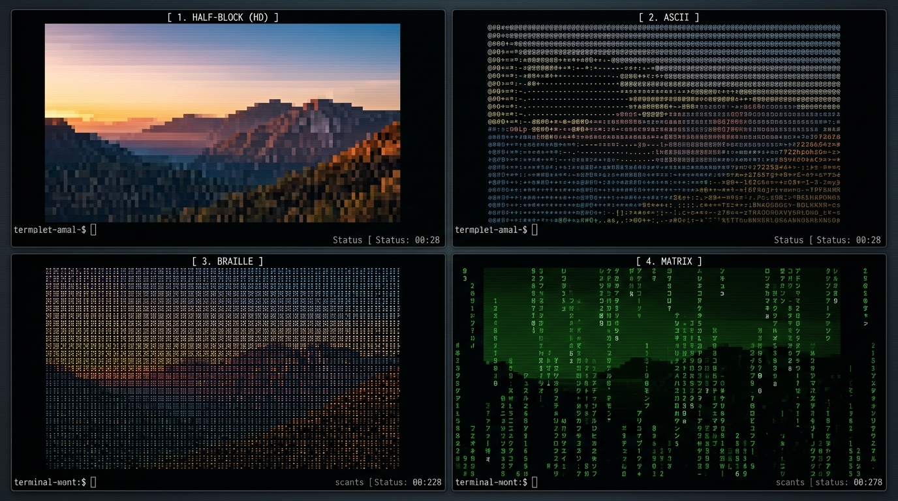

# 🎬 cli_vid — High-Performance Terminal Video Player

<p align="center">
  
</p>

<p align="center">
  <strong>Stream local videos and live network feeds directly in your terminal with 24-bit TrueColor ANSI, multiple rendering modes, and synchronized audio.</strong>
</p>

<p align="center">
  
  
  
  
  
  
</p>

---

## ✨ Features

- **🎨 4 Distinct Rendering Modes:** Half-block TrueColor (HD), Dithered ASCII, High-density Braille matrix, and Cyberpunk Matrix green. Switch between them instantly during playback.
- **⚡ Zero-Allocation ANSI Serialization:** Custom terminal serializer achieves **~1.15 ms/frame with 0 heap allocations/frame** for 160×44 cells.
- **🔊 Synchronized Audio:** Seamless audio playback powered by `ffplay` with volume adjustments, instant muting, and seek synchronization.
- **🌐 Universal Media Input:** Plays local video files (`.mp4`, `.mkv`, `.avi`, `.webm`, `.mov`, etc.) and direct network streams (`http://`, `https://`, `rtsp://`).
- **🎯 Dynamic Bilinear Resampling & Aspect Fitting:** Automatically accounts for 2:1 terminal cell aspect ratios and window resizing without distorted proportions.
- **🏎️ Smooth Playback Pipeline:** Frame deadlines account for rendering time; late frames are gracefully dropped during catch-up to prevent stutter.
- **🎛️ Responsive Interactive Controls:** Separate input listener goroutine handles fragmented escape codes, arrow sequences, and instant key response without blocking the decode loop.
- **📊 Adaptive On-Screen Display (OSD):** Real-time 2-row terminal overlay showing timecode, interactive progress bar, target FPS, volume, and active mode without edge-scrolling glitches.
- **🤖 Scriptable Metadata Mode:** `-info` flag prints media dimensions, FPS, duration, and audio streams in structured JSON without initializing terminal graphics.

---

## 🖼️ Rendering Modes

Cycle through all 4 modes on the fly by pressing <kbd>M</kbd> during playback:

<p align="center">
  
</p>

| Mode | Flag | Description | Ideal For |
| :--- | :--- | :--- | :--- |
| **Half-Block (HD)** | `-mode block` | Stacks 2 vertical pixels per terminal cell using foreground and background 24-bit TrueColor ANSI codes. | Movies, high-motion scenes, photorealistic detail. |
| **ASCII** | `-mode ascii` | 70-character density ramp combined with Bayer ordered dithering and TrueColor shading. | Classic retro aesthetic, rich text density. |
| **Braille Matrix** | `-mode braille` | Uses 8 dots per cell (2×4 dot matrix) with dithering and foreground RGB coloring. | Ultra-high spatial resolution, line art, diagrams. |
| **Matrix Green** | `-mode matrix` | Shaded monochrome green phosphor ramp using Katakana, numbers, and symbols. | Cyberpunk visual styling, stylized surveillance feeds. |

---

## 📋 Requirements

1. **Go 1.27+** (to build from source) or pre-built executable.
2. **Python 3.13+ & uv** (optional, for uv project workspace integration).
3. **FFmpeg toolchain** available on your `PATH`:
   - `ffmpeg` & `ffprobe` (required for video decoding and probing).
   - `ffplay` (optional, for audio playback. If absent, video plays silently).
4. **Terminal with 24-bit TrueColor support:**
   - **Windows:** Windows Terminal, WezTerm, Alacritty.
   - **macOS:** iTerm2, Kitty, Ghostty, Alacritty.
   - **Linux:** Kitty, Alacritty, GNOME Terminal, Konsole.

### Installing FFmpeg

#### Windows (winget or scoop)
```powershell
winget install Gyan.FFmpeg
# or
scoop install ffmpeg
```

#### macOS (Homebrew)
```bash
brew install ffmpeg
```

#### Linux (Debian / Ubuntu / Arch)
```bash
# Ubuntu / Debian
sudo apt update && sudo apt install ffmpeg

# Arch Linux
sudo pacman -S ffmpeg
```

---

## 🚀 Quick Start

### 1. Build and Run with Go

```powershell
# Clone the repository
git clone https://github.com/AakashBhat1/cli_vid.git
cd cli_vid

# Compile binary
go build -o cli_vid.exe .

# Play a video
.\cli_vid.exe sample.mp4
```

*(On Linux / macOS, compile with `go build -o cli_vid .` and run `./cli_vid sample.mp4`)*

### 2. Run with uv (Python)

If you use `uv`:

```bash
# Sync dependencies
uv sync

# Run the cli-vid package
uv run cli-vid
```

---

## 💡 Usage Examples

```powershell
# High quality half-block playback at 30 FPS (default)
.\cli_vid.exe -quality high -fps 30 "C:\Videos\movie.mp4"

# High-density Braille mode for extreme resolution
.\cli_vid.exe -mode braille movie.mp4

# Cyberpunk Matrix green mode
.\cli_vid.exe -mode matrix movie.mp4

# Optimize for low-spec or remote SSH terminals
.\cli_vid.exe -quality low -fps 15 movie.mp4

# Start at 1 minute 20 seconds, loop continuously, start muted
.\cli_vid.exe -start 1m20s -loop -mute movie.mp4

# Custom seek step (10s) and quieter starting volume (40%)
.\cli_vid.exe -seek-step 10s -volume 40 movie.mp4

# Silent playback and automatic exit upon reaching EOF
.\cli_vid.exe -no-audio -exit-on-end movie.mp4

# Stream an online video over HTTP/HTTPS
.\cli_vid.exe "https://commondatastorage.googleapis.com/gtv-videos-bucket/sample/BigBuckBunny.mp4"

# Stream an IP camera or live feed over RTSP
.\cli_vid.exe "rtsp://wowzaec2demo.streamlock.net/vod/mp4:BigBuckBunny_115k.mp4"

# Non-interactive metadata extraction (JSON output for scripts)
.\cli_vid.exe -info movie.mp4
```

Example `-info` output:
```json
{
  "width": 1920,
  "height": 1080,
  "fps": 30.0,
  "duration_seconds": 124.5,
  "has_audio": true
}
```

---

## ⚙️ Options & Flags

| Flag | Default | Description |
| :--- | :--- | :--- |
| `-mode` | `block` | Rendering mode: `block`, `ascii`, `braille`, `matrix` (or `0`–`3`). |
| `-quality` | `high` | Max decoded dimension (`low`: 320px, `medium`: 640px, `high`: 1280px). Never upscales source. |
| `-fps` | `30` | Maximum playback frame rate (1–120), capped at the source video's native rate. |
| `-volume` | `80` | Initial audio volume percentage (0–100). |
| `-start` | `0s` | Playback start offset using Go duration syntax (e.g. `30s`, `1m20s`, `1h15m`). |
| `-seek-step` | `5s` | Jump interval when seeking forward/backward with arrows or A/D keys. |
| `-mute` | `false` | Start playback with audio muted (press <kbd>U</kbd> to unmute). |
| `-no-audio` | `false` | Disables audio subsystem and `ffplay` spawn completely. |
| `-loop` | `false` | Automatically rewind and replay from the beginning on EOF. |
| `-exit-on-end` | `false` | Automatically restore terminal and exit when video reaches the end. |
| `-info` | `false` | Inspect video streams and output JSON metadata without starting playback. |
| `-help` | | Display flag summaries and keyboard controls. |

---

## 🎮 Interactive Keyboard Controls

| Key | Action |
| :--- | :--- |
| <kbd>Space</kbd> | **Play / Pause** toggle; replay when playback has finished. |
| <kbd>←</kbd> / <kbd>→</kbd> or <kbd>A</kbd> / <kbd>D</kbd> | **Seek Backward / Forward** by the configured `-seek-step` interval. |
| <kbd>↑</kbd> / <kbd>↓</kbd> or <kbd>W</kbd> / <kbd>S</kbd> or <kbd>+</kbd> / <kbd>-</kbd> | **Volume Up / Down** by 10%. |
| <kbd>M</kbd> | **Cycle Rendering Modes** (`Block` ➔ `ASCII` ➔ `Braille` ➔ `Matrix`). |
| <kbd>U</kbd> | **Toggle Mute / Unmute**. |
| <kbd>L</kbd> | **Toggle Looping** mode on/off. |
| <kbd>R</kbd> | **Restart** video from the beginning. |
| <kbd>Q</kbd> / <kbd>Esc</kbd> / <kbd>Ctrl+C</kbd> | **Quit** immediately and cleanly restore terminal state. |

> [!TIP]
> Seeking while paused immediately renders a single-frame preview at the target timestamp without resuming playback!

---

## 🏗️ Architecture & Code Map

```
┌─────────────────┐       ┌─────────────────┐       ┌──────────────────┐
│  FFmpeg Decode  │ ────> │ Bilinear Resizer│ ────> │ Zero-Alloc ANSI  │ ────> Terminal
│ (Asynchronous)  │       │ (Aspect-Fitted) │       │ Serializer (4x)  │       Raw Output
└─────────────────┘       └─────────────────┘       └──────────────────┘
         │
         ▼
┌─────────────────┐
│  FFplay Audio   │ (Synchronized seek & volume via child process)
└─────────────────┘
```

| File | Subsystem & Responsibility |
| :--- | :--- |
| [`main.go`](file:///C:/dev/cli_vid/main.go) | Startup, CLI validation, external tool detection, terminal lifecycle management. |
| [`options.go`](file:///C:/dev/cli_vid/options.go) | Command-line flag parsing, validation, bounds enforcement, and help text. |
| [`player.go`](file:///C:/dev/cli_vid/player.go) | Interactive main loop, clock synchronization, seek/replay orchestration, and screen rendering. |
| [`video.go`](file:///C:/dev/cli_vid/video.go) | FFprobe metadata parsing, pooled asynchronous frame extraction, bilinear resampling. |
| [`modes.go`](file:///C:/dev/cli_vid/modes.go) | 4 ANSI rendering pipelines, Bayer dithering matrices, and allocation-free color serialization. |
| [`audio.go`](file:///C:/dev/cli_vid/audio.go) | FFplay child process lifecycle, volume adjustment, and audio seeking. |
| [`input.go`](file:///C:/dev/cli_vid/input.go) | Low-level streaming ANSI escape sequence parser with non-blocking key decoding. |
| [`osd.go`](file:///C:/dev/cli_vid/osd.go) | Responsive terminal overlay formatting, dynamic progress bar, and status notifications. |
| [`console_windows.go`](file:///C:/dev/cli_vid/console_windows.go) / [`console_other.go`](file:///C:/dev/cli_vid/console_other.go) | Platform-specific terminal raw mode configuration and clean shutdown restoration. |

---

## 🧪 Testing & Verification

The test suite includes unit tests, rendering regression checks, and integration tests that dynamically generate lossless video and audio fixtures with FFmpeg:

```powershell
# Run unit and rendering tests (fast, no FFmpeg required)
go test -short ./...

# Run all tests including dynamic FFmpeg integration tests
go test -v -timeout 60s ./...

# Run static analysis
go vet ./...

# Run rendering performance benchmarks
go test -short -bench . -benchmem ./...

# Concurrency race condition detection (requires CGO / GCC)
go test -race ./...
```

---

## 📄 License

Distributed under the MIT License. See [LICENSE](LICENSE) for details.
